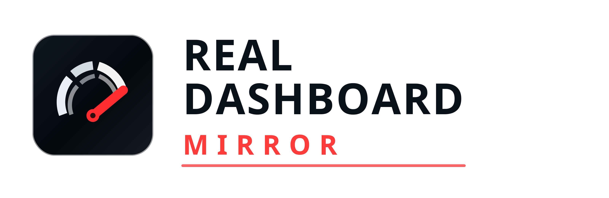

# Real Dashboard Mirror



Real Dashboard Mirror is a beta tool for sim racers who want to stream a hidden dashboard area from a Windows racing game to an Android phone, tablet, or TV browser on the local network.

The Windows app runs the capture and local stream server. The Android app and browser viewer are viewers only; they do not capture the game and do not use telemetry, WebRTC, or cloud services.

## Download

Get the latest public beta from the GitHub Releases page:

[Real Dashboard Mirror V1.0 Free Beta](https://github.com/sebastiensanchez83-stack/real-dashboard-mirror-releases/releases/tag/v1.0-free-beta)

Recommended download:

- `DashMirrorOverscan-V1.0-FreeBeta-Exe.zip` for Windows.
- `DashMirrorViewer-V1.0-FreeBeta-Android-debug.apk` for Android sideloading.
- `DashMirrorOverscan-V1.0-FreeBeta-PortableFallback.zip` if the single-file EXE does not run on your machine.

## Quick Start

1. Launch the Windows app.
2. Start your racing game in windowed or borderless mode.
3. Select the game in DashMirror.
4. Apply a bottom overscan preset.
5. Refresh the game resolution or placement.
6. Confirm the hidden dashboard area appears in the preview.
7. Adjust and validate the crop.
8. Start the phone/TV viewer.
9. Open the displayed LAN URL, for example `http://192.168.x.x:5055/`.

For TV browsers, try:

```text
http://<pc-lan-ip>:5055/tv?fps=60&w=1280
```

## Beta Limits

The Free Beta includes a 10 minute capture-session limit. A beta license unlock can enable unlimited capture during the beta period.

Compatibility depends on how each game renders oversized or hidden window regions. Some games may resize the window but not render useful content in the hidden overscan area.

## Repository Scope

This public repository is for downloads, release notes, and marketing/user-facing files only. Source code is not published here.

