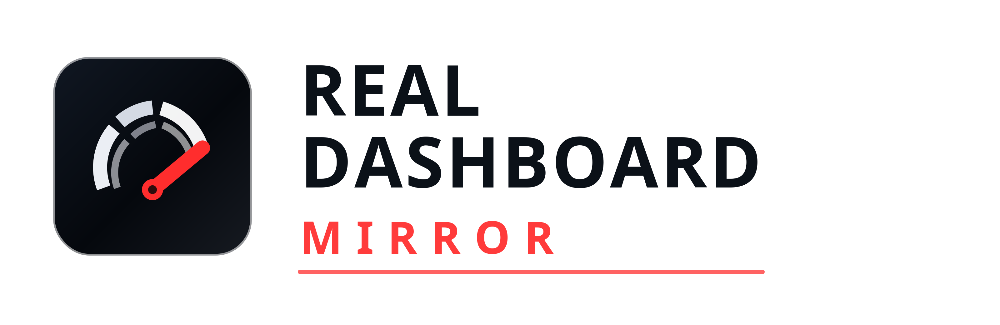

# RealDash Mirror

Your simracing dashboard, on your phone, tablet, TV or HDMI display.
RealDash Mirror captures a Windows game window and sends selected dashboard
regions to local devices. Three independent crops: Dash, Output 2 and Output 3.

## Download 1.0.6 - Pitlane

- [Windows Free portable EXE ZIP](https://github.com/sebastiensanchez83-stack/real-dashboard-mirror-releases/releases/download/untagged-6ef17be6f6d29e5a00d8/RealDashMirror-v1.0.6-Free-17da6a9d-SingleFile.zip)
- [Windows Free portable fallback ZIP](https://github.com/sebastiensanchez83-stack/real-dashboard-mirror-releases/releases/download/untagged-6ef17be6f6d29e5a00d8/RealDashMirror-v1.0.6-Free-17da6a9d-PortableFallback.zip)
- [Release notes and checksums](https://github.com/sebastiensanchez83-stack/real-dashboard-mirror-releases/releases/tag/v1.0.6)
- [Android Viewer APK (unchanged, compatible)](https://github.com/sebastiensanchez83-stack/real-dashboard-mirror-releases/releases/download/v1.0.5-free-beta/RealDashMirrorViewer-V1.0.5-Free-Android-debug.apk)

## Quick start

1. Extract the Windows ZIP and launch DashMirrorOverscan.exe.
2. Open Pitlane and select your running game, or apply a saved car profile.
3. Adjust Area below the screen, then Apply and continue.
4. Frame Dash and any enabled Output 2/3 crops. Choose network viewing and/or HDMI.
5. Confirm crops, then Launch my session. Mini Pin opens automatically when enabled.
6. In Settings, scan the QR or open the displayed LAN URL on your phone or TV.

Browser viewer: `http://<pc-lan-ip>:5055/` on the same LAN.
For TV browsers: `http://<pc-lan-ip>:5055/tv?fps=30&w=1280`.
Use Restore game to return to normal window placement.

## Free and Pro

Free capture is limited to 10 minutes per session. A valid Pro license unlocks
unlimited capture. The Android app and browser pages are viewers only.

## Compatibility

Windows capture, oversized rendering and performance depend on the game and GPU.
Some games do not draw the hidden area even when the window can be resized.
The app does not inject into games or modify EDID or Windows display topology.

## Repository scope

This public repository contains downloads, release notes and user-facing media.
The application source repository remains private.